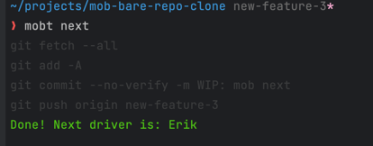
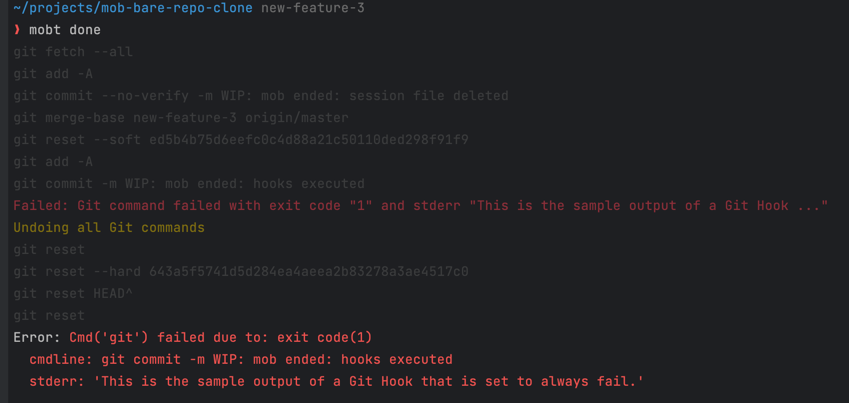

# Mob-Tool

Mob-Tool is a command-line tool to manage mob programming sessions for teams working remotely. The tool helps the team
to manage the session by controlling the timer and switching the driver role among the team members and also by
simplifying
the necessary Git commands to hand over the work to the next team member.


> Mob programming is a development technique where a team of developers works together on the same task at the same
> time.

## What changes does the tool make to the repository?

- **No changes are done in main branch.** All the changes are done in a new feature branch. You choose the name of the
  branch
  when you start the mob session.
- **All Git command executed by the tool are logged in the output.** This way, the team can easily see what changes are
  being done to their repository.
- **All commands are rollback if any error occurs.** The commands to rollback are also logged in the output.

## Installation

```shell
pip install mob-tool
```

## Usage

To start a new mob programming session, with the following command:

```shell
mobt start <branch-name>
```

See below an example of the output of the `start` command:


When your time is up, the driver role to the next team member with the following command:

```shell
mobt next
```

See below an example of the output of the `next` command:


You must call this command even if you didn't make any changes in the code so the mob tool can manage whose turn is
next. The next drive (in this example, Erik) can start working by running the same `mobt start <branch-name>` command:

When your feature is ready, you can end the mob programming session with the following command:

```shell
mobt done
```

It will squash all the commits, and push all the changes to the remote. All git hooks will be executed for this final
commit. The hooks are always ignored during for the `start` and `next` commands.

See below an example of the output of the `done` command:


### Output example with rollback


